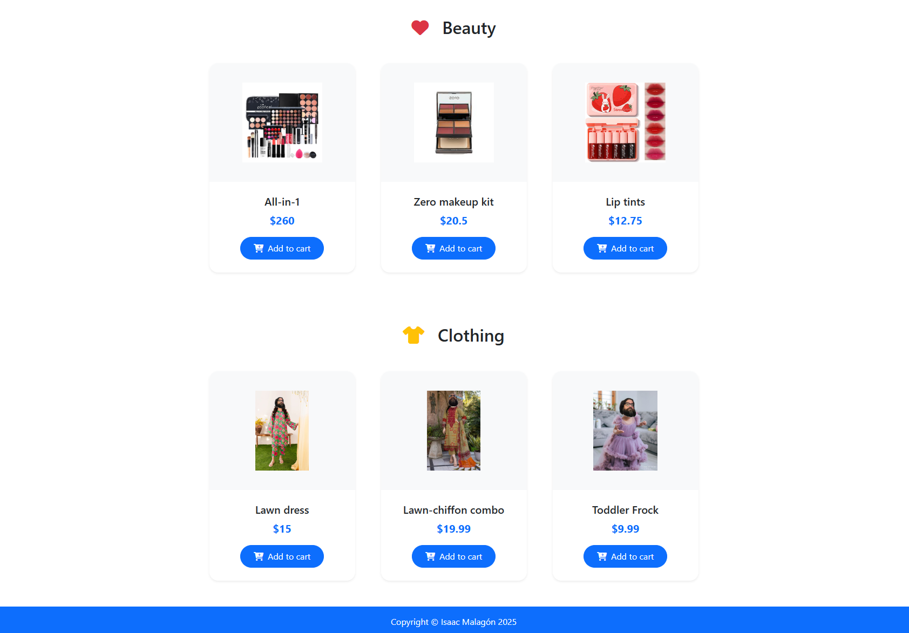
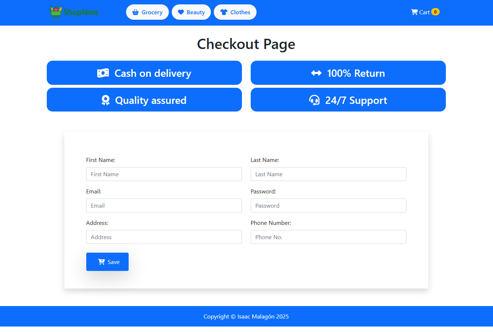
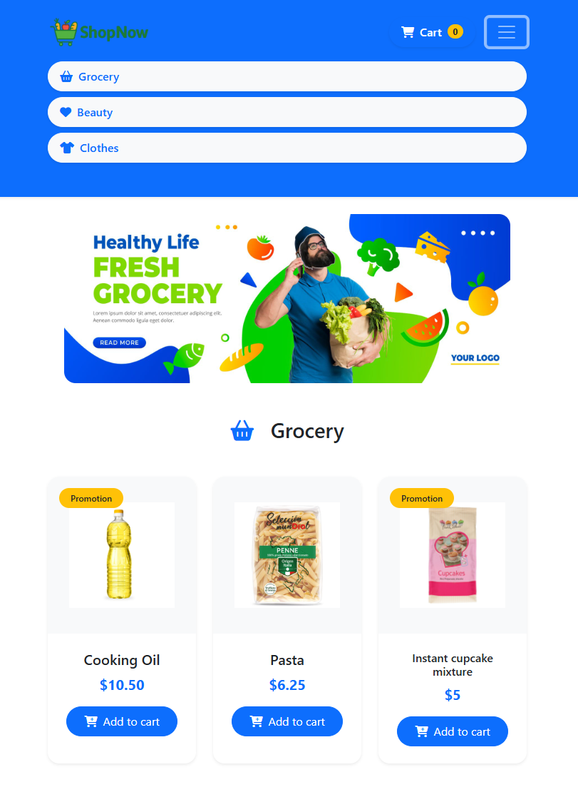
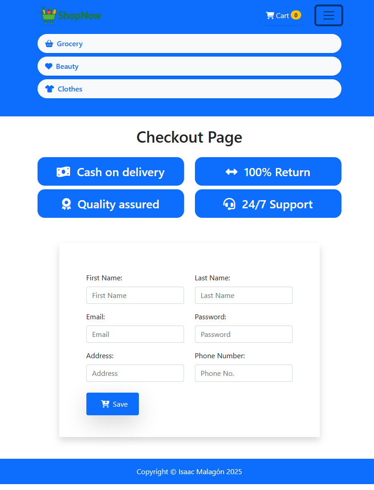

# frontend-shop

[](https://github.com/RichardLitt/standard-readme)
<!-- TODO: Add more badges here (e.g. license, build, etc.) -->

**Frontend shop** built with **Bootstrap**, designed with a desktop approach.

---

## Table of Contents

- [Background](#background)
- [Technologies](#technologies)
- [Structure](#structure)
- [Installation](#installation)
- [Screenshots](#screenshots)
- [Maintainers](#maintainers)
- [Contributing](#contributing)
- [License](#license)

---

## Background

This project started as a web layout practice with the goal of recreating an **e-shop** using Bootstrap and JavaScript.  
It focuses on how an e-store works, including the basket, the checkout page, how promotions apply to the basketc, etc.

---

## Technologies

- HTML5
- BootStrap
- JavaScript

---

## Structure

``` text
├── css/ # Stylesheets (CSS files)
├── images/ # Project images and assets
├── js/ # JavaScript files
├── checkout.html # Checkout page
├── index.html # Main landing page
└── README.md # Project documentation
```

---

## Installation
```text
# Clone the repository
git clone https://github.com/isaacmg-bit/js-basics-Sprint-2.2.git

# Navigate to the project folder
cd starter-code-frontend-shop

# Launch index.html
Launch index.html with GoLive server or just access the folder and open it on your browser
```

---

## Screenshots

### Desktop
 



### Mobile



---

## Maintainers

[@Isaac Malagón](https://github.com/isaacmg-bit)

---

## Contributing
```text
1. Fork this repository
2. Create a new branch (`git checkout -b feature/your-feature`)
3. Make your changes and commit (`git commit -m 'Add new feature'`)
4. Push to your branch (`git push origin feature/your-feature`)
5. Create a Pull Request
```
**Pull requests** are welcome.  
If you edit the README, please make sure to follow the  
[standard-readme](https://github.com/RichardLitt/standard-readme) specification.

---

## License

This work is licensed under a [Creative Commons Attribution-NonCommercial 4.0 International License](https://creativecommons.org/licenses/by-nc/4.0/).  
© 2025 Isaac Malagón — Commercial use and redistribution are not allowed without permission.
